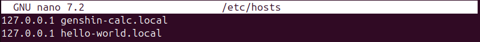

## Лабораторная работа 1

Первым делом я решил разобраться что это за nginx такой и с чем его едят. Для этого я полез на официальный сайт читать документацию. Работал я на Ubuntu через VirtualBox.

Я захотел создать свой nginx.conf в директории clouds, но он упорно отказывался запускаться через этот конфиг и работал в `/etc/nginx`. Я решил сдаться и изменять изначальный конфиг. 

Далее я столкнлся с тем, что nginx не мог читать файлы из моей директории `clouds`. Как оказалось у него нет прав. Я по-разному пытался дать ему права на эти папки, но в итоге забил и сделал ему пользователся root, что с точки зрения безопасности неправильно, но быстро решило мою проблему. 

Я поднял свой проект из прошлого семестра на Flask и настроил nginx, чтобы он проксровал с порта 8080 на порт 5000 и о чудо, оно заработало!


Для второго сайта я сделал простую заглушку Hello world на FastAPI через сервер uvicorn на порт 8000. 

Теперь я приступил к сертификатам. Пару гугл запросов, ответов чата гпт и статья на хабре и вот я уже делаю самоподписанный сертификат. Также я поменял DNS в Ubuntu, чтобы сделать себе 2 доменных имени: `genshin-calc.local` и `hello-world.local` 

Сначала жёстко не работало (502 bad gateway), потом внезапно заработало, но оба домена направляли на сайт с калькулятором. Сел разбираться и понял, то у меня вместо 443 для HTTPS стоял 413.

Настало время разбираться с `alias`. Самым простым решением было сделать перенаправление всех файлов `/static/` в директорию `app/static` веб-приложения genshin-calculator.
```nginx
location /static/ {
            alias /home/vboxuser/genshin-calculator/app/static/;
}
```
Однако возникла непредвиденная проблема - все стили на сайте слетели. 

Я немного покопался в консоли разработчика и понял, что клиент получал файл со стилями, но его тип определялся неверно. Поправил это с помощью ручного определения типа:
```nginx
types {
    text/css css;
}
```
И всё зарабоатло как надо. 